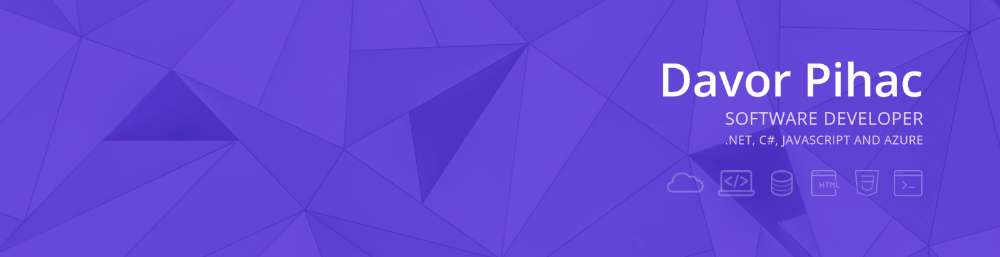

Hi friends 👋

I'm Davor and come from Croatia. I've started programming as a kid in BASIC on C64. I discovered HTML and CSS in high school and web development has become a passion of mine ever since.

Tools of my choice are **C#**, **.NET** (Core), and **ASP.NET Core**, which I use daily. Other languages that I have experience with are Go, **JavaScript** and TypeScript.

I use **SQL** and **NoSQL** databases, have experience with various cloud providers like **Azure** and **Digital Ocean**, use Azure DevOps and Docker.
